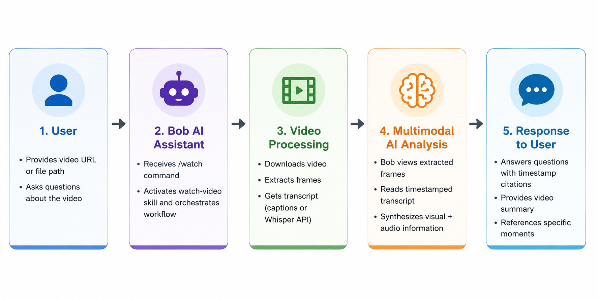

# Bob Watch Video Skill

**Give IBM Bob the ability to watch and analyze any video.**

> **🎬 Inspired by and adapted from:** [claude-video](https://github.com/bradautomates/claude-video) by Bradley Bonanno ([@bradautomates](https://github.com/bradautomates))
> 
> This is a Bob-compatible version of the original Claude Video skill. All credit for the core concept and implementation goes to the original author.

## What This Does

This skill enables IBM Bob to:
- 📹 Download and analyze videos from YouTube, Vimeo, TikTok, X, and hundreds of other platforms
- 🖼️ Extract frames at strategic intervals to see what's on screen
- 🎤 Get transcripts from native captions or Whisper API
- 💬 Answer questions about video content based on both visual and audio information

## Architecture



The skill follows a simple pipeline: User provides a video → Bob activates the skill → Video is processed (download, frame extraction, transcript) → Bob's multimodal AI analyzes the content → User receives answers with timestamp citations.

## Quick Start

### 1. Installation

```bash
# Clone the repository
git clone https://github.com/Dheeraj-Arremsetty/watch-video-bob.git

# Open the folder in Bob
# Bob will automatically detect the .bob/skills directory
```

**That's it!** Bob automatically discovers skills in any `.bob/skills/` directory within your workspace.

### 2. Configure API Keys (Optional)

For videos without native captions, add a Whisper API key:

```bash
cd watch-video-bob
cp .env.example .env
# Edit .env and uncomment your preferred API key (Groq or OpenAI)
```

See [BOB_SETUP.md](.bob/skills/watch-video/BOB_SETUP.md) for detailed instructions.

### 3. First Use

The first time you use `/watch`, Bob will guide you through installing dependencies:
- `ffmpeg` and `yt-dlp` (auto-installed on macOS via Homebrew)
- Optional: Whisper API key for transcription (if not already configured)

### 4. Try It

```
/watch https://youtu.be/dQw4w9WgXcQ
/watch https://youtu.be/VIDEO_ID what happens at 2:30?
/watch ~/Videos/recording.mp4 when does the error occur?
```

## Documentation

- **[BOB_SETUP.md](.bob/skills/watch-video/BOB_SETUP.md)** - Complete setup guide for IBM Bob users
- **[README.md](.bob/skills/watch-video/README.md)** - Detailed feature documentation
- **[CHANGELOG.md](.bob/skills/watch-video/CHANGELOG.md)** - Version history

## Features

### Supported Video Sources
- YouTube, Vimeo, TikTok, X (Twitter), Instagram
- Local video files (`.mp4`, `.mov`, `.mkv`, `.webm`, etc.)
- Any platform supported by yt-dlp (hundreds of sites)

### Smart Frame Extraction
- Auto-scaled frame rate based on video duration
- Focused mode for specific time ranges (`--start`, `--end`)
- Configurable resolution for reading on-screen text

### Flexible Transcription
- Native captions (free, preferred)
- Whisper API fallback (Groq or OpenAI)
- Option to skip transcription entirely

## Usage Examples

### Basic Analysis
```
/watch https://youtu.be/VIDEO_ID
/watch https://youtu.be/VIDEO_ID summarize this
/watch bug-recording.mp4 what's going wrong?
```

### Focused Analysis (Better Accuracy, Lower Cost)
```
/watch https://youtu.be/VIDEO_ID --start 2:15 --end 2:45
/watch video.mp4 --start 30 --end 60
/watch https://youtu.be/VIDEO_ID --start 1:12:00  # from 1h12m to end
```

### Advanced Options
```
/watch VIDEO_URL --max-frames 40           # Lower token cost
/watch VIDEO_URL --resolution 1024         # Read on-screen text
/watch VIDEO_URL --whisper groq            # Force Groq transcription
/watch VIDEO_URL --no-whisper              # Skip transcription
```

## Requirements

- **Python 3** (macOS/Linux) or **Python** (Windows)
- **ffmpeg** and **yt-dlp** - auto-installed on macOS, manual on Linux/Windows
- **Whisper API key** (optional) - Groq (recommended) or OpenAI

## Best Practices

1. **Videos under 10 minutes** work best for full analysis
2. **Use `--start`/`--end`** for longer videos to focus on relevant sections
3. **Native captions are free** - most YouTube videos have them
4. **Groq is faster and cheaper** than OpenAI for Whisper transcription

## Token Efficiency

- 80 frames at 512px ≈ 50-80k image tokens
- Transcripts are cheap (few thousand tokens for 10-min video)
- `--resolution 1024` quadruples image tokens per frame
- Use focused mode to reduce token cost on long videos

## Privacy & Security

- Videos downloaded locally to temp directories
- Only extracted audio sent to Whisper API (when needed)
- No video content uploaded to any service
- API keys stored locally with restricted permissions
- Working directories cleaned up after use

## Credits

**Original Project:** [claude-video](https://github.com/bradautomates/claude-video) by Bradley Bonanno ([@bradautomates](https://github.com/bradautomates))

This Bob adaptation maintains the same MIT license and core functionality while adapting the interface for IBM Bob users.

Built on `yt-dlp`, `ffmpeg`, and Bob's multimodal `Read` tool. Whisper transcription via [Groq](https://groq.com) or [OpenAI](https://openai.com).

## License

MIT License - see [LICENSE](.bob/skills/watch-video/LICENSE)

Original Copyright (c) 2026 Bradley Bonanno  
Bob adaptation by [Your Name]

---

**Links:**
- [Original Repository](https://github.com/bradautomates/claude-video)
- [Setup Guide](./bob/skills/watch-video/BOB_SETUP.md)
- [Detailed Documentation](./.bob/skills/watch-video/README.md)